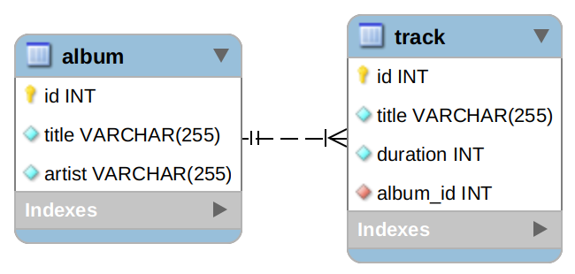

# NODE MUSICS - CHECKPOINT 3

## :zero: Setup

Avant de commencer quoi que ce soit d'autre, votre première mission est de **cloner** ce projet, puis de créer une branche avec votre nom et prénom comme ceci : `lastname_firstname`.

Configurer votre projet afin qu'aucune erreur ne soit retournée par la commande `npm run dev`.

---

**A chaque fois que tu complètes un exercice:**

- Fais un commit avec un message EXPLICITE sur ta branche.
- Fais un push de ta branche.

**Conseils importants :**

- n'essaie par de tout faire, cible ce qui est le plus rapide
- si tu bloques, passe à l'exercice suivant
- ne fait pas les bonus avant d'avoir terminé tout le reste du checkpoint !
- tu peux utiliser Internet, tes notes, les quêtes, les cours (mais utilise ta tête en premier !)

## :one: Modélisation de la base de données

La SPA de Capbreton a besoin de nous !

Actuellement leurs hôtes ont chacun une fiche papier mais ça devient le calvaire. Ils ont commandé une application permettant de recenser tous les pensionnaires : chiens, chats, canards (oui, c'est les Landes). Il n'est pas prévu d'avoir plus de races d'animaux.

Un pensionnaire a un prénom (deux animaux peuvent avoir le même), un age, une date d'entrée, une photo et une date de sortie. On doit pouvoir dire si un pensionnaire est un chien, un chat ou un canard.

La SPA doit pouvoir accèder à tous les compte-rendus vétérinaires des pensionnaires : date de visite, motif de la visite et description.

Ils veulent également pouvoir filtrer en fonction des tolérances de chaque pensionnaire, dans un premier temps :
​

- Cohabitation possible avec chien
- Cohabitation possible avec chat
- Cohabitation possible avec canard
- Apprécie la présence des enfants

La SPA prévoit qu'il soit possible d'ajouter d'autres tolérances plus tard.

En vous basant sur l'énoncé, réalisez le **MCD** et le **MLD** (vous pouvez le faire en français).

Une fois terminé, prenez une photo et committez-la sur votre branche.

> Il faut que ce soit lisible (pensez à mes yeux :eyes:)

## :two: NodeJS / Express

### Mise en route :point_down:

Le projet est livré avec ESLint et Prettier.

Dans le répertoire du projet, vous pouvez exécuter différents scripts :

- `npm run dev` : Lance l'application en mode développement en utilisant `nodemon` sur le port 5000 par défaut.
- `npm run lint` : Cette application est fournie avec une configuration ESLint basique (Prettier + React), vous pouvez lancer une vérification à chaque fois en utilisant ce script.

---

**Dans cette étape, vous allez créer une API qui vous permet de gérer des albums et des pistes avec Node/Express**.

_S'il vous plaît, n'oubliez pas de faire des commits atomiques avec des messages explicites_ :pray:

Voici le schéma de la base de données :

---

### Configuration

Importez la base de données à partir du fichier `database.sql`.

Ajoutez la configuration nécessaire à l'accès à la base de données.

### Règles

- :heavy_check_mark: Respectez les bonnes pratiques RESTful : attention aux codes HTTP de retour (en cas de succès et en cas d'erreur) !

### Votre mission

Créez les routes suivantes :

### Albums

- `POST /albums` : créer un nouvel album
- `GET /albums` : récupérer la liste complète des albums
- `GET /albums/{albumId}` : récupérer un album par son identifiant
- `PUT /albums/{albumId}` : mettre à jour un album

### Pistes

- `POST /albums/{albumId}/tracks` : créer une nouvelle piste
- `DELETE /albums/{albumId}/tracks/{trackId}` : supprimer une piste
- `GET /albums/{albumId}/tracks` : récupérer toutes les pistes d'un album

#### Bonus 1 : Recherche

Répondre aux histoires utilisateurs suivantes :

- en tant qu'utilisateur, je peux rechercher les albums d'un artiste
- en tant qu'utilisateur, je peux rechercher des albums par leur titre (même incomplet)

#### Bonus 2 : Validation

Ajouter la validation des données pour les routes en POST et PUT

#### Bonus 3 : Authentification

Répondre aux histoires utilisateurs suivantes (vous pouvez ajouter une vérification par JWT) :

- en tant qu'utilisateur, je dois pouvoir m'inscrire avec un email et un mot de passe
- en tant qu'utilisateur, je dois pouvoir m'authentifier
- en tant qu'utilisateur authentifié, je dois pouvoir ajouter un album à ma liste de favoris

## It's done ! Congrats !

Vous pouvez maintenant vous détendre :beers:

Mais pensez à bien tout versionner :wink:
